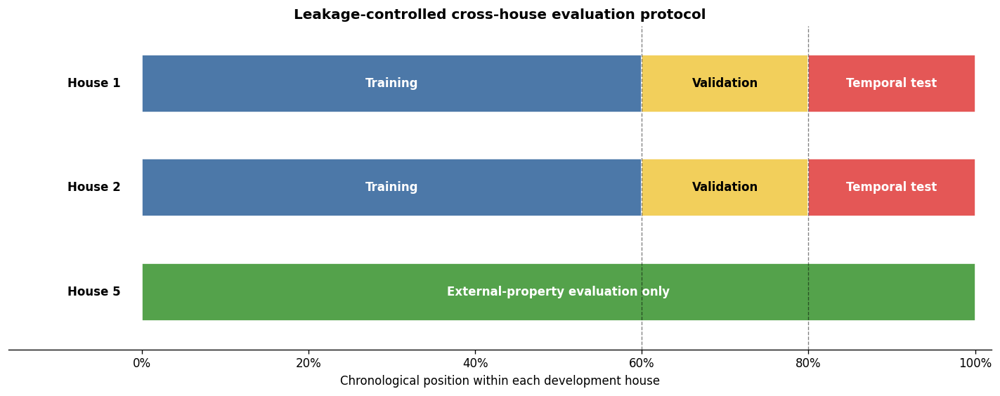
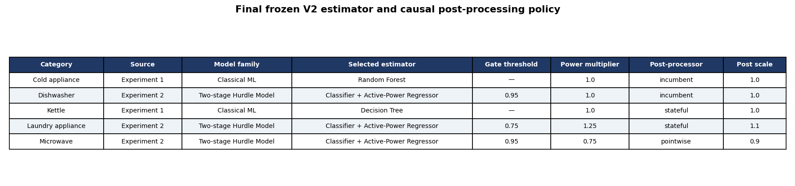
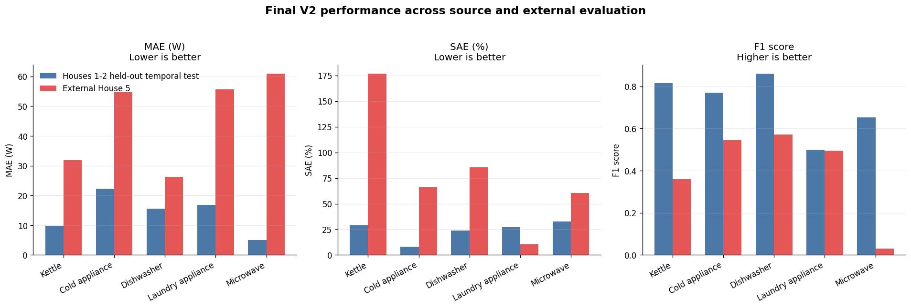
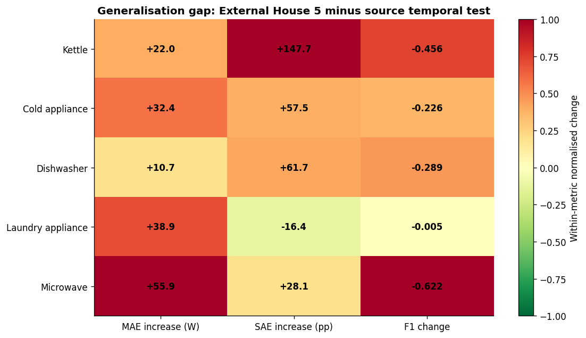
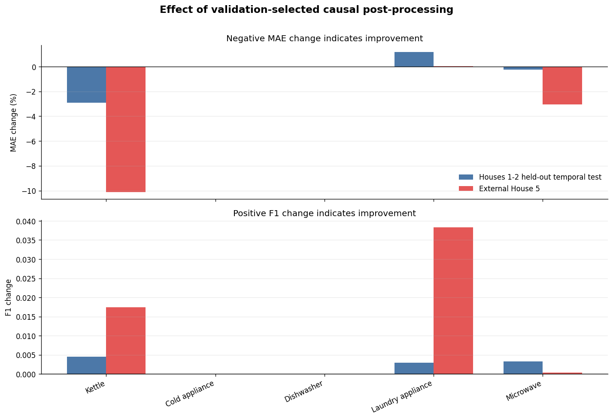
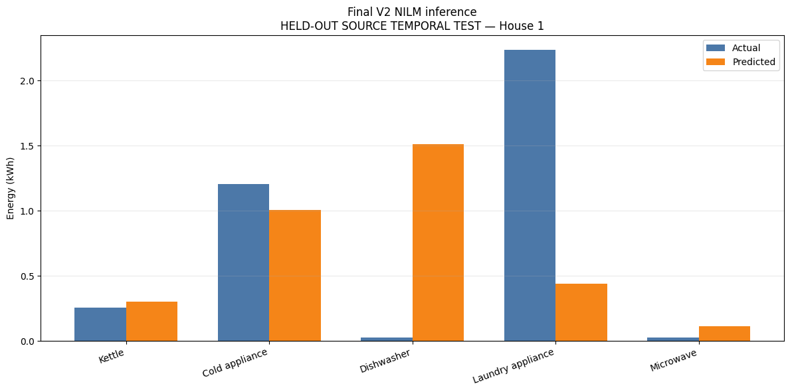
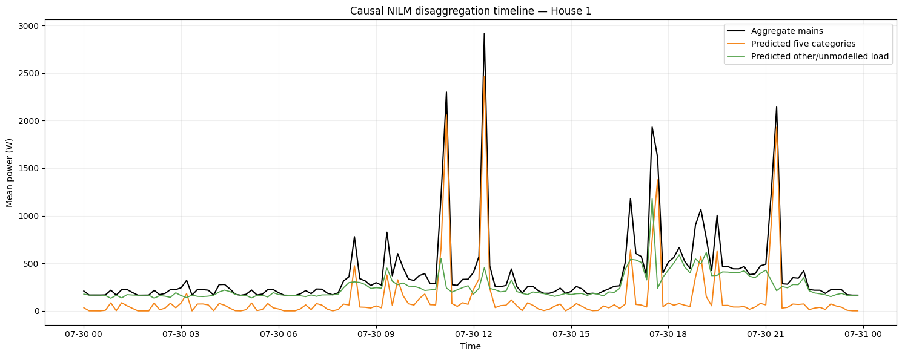

# Cross-House NILM Generalisation Using UK-DALE

**Leakage-controlled non-intrusive load monitoring with classical machine learning, causal deep learning, two-stage hurdle models, validation-only model selection, and external-house evaluation.**

This repository contains the portfolio version of my MSc Data Science dissertation project:

> **Evaluating Cross-House Generalisation in Non-Intrusive Load Monitoring Using UK-DALE**

Non-Intrusive Load Monitoring (NILM) estimates appliance-level electricity consumption from a household's aggregate mains signal. The central question in this project is not simply whether a model can perform well on a known household, but whether that performance transfers to another property without retraining or target-house adaptation.

---

## Project Highlights

- **Dataset:** UK-DALE
- **Development houses:** Houses 1 and 2
- **External evaluation property:** House 5
- **Sampling interval:** 10 seconds
- **Appliance categories:** kettle, cold appliance, dishwasher, laundry appliance, microwave
- **Input representation:** 24 causal aggregate-mains/time features
- **Evaluation design:** chronological 60% train / 20% validation / 20% temporal test
- **Model families:** baselines, classical ML, MLP, causal CNN, unidirectional LSTM, and two-stage hurdle models
- **Selection rule:** estimator and post-processing choices made using source validation data only
- **Final evaluation:** frozen policy tested on held-out source periods and external House 5
- **Physical consistency:** predicted appliance powers are constrained to be non-negative and their total cannot exceed aggregate mains

---

## Why This Project Matters

A NILM model can appear strong when evaluated on later data from households already represented during development, yet fail when transferred to another home.

This project separates two questions:

1. **Temporal generalisation:** does the model work on later unseen periods from Houses 1 and 2?
2. **Cross-house generalisation:** does the same frozen policy work on House 5 without retraining?

The results show a substantial domain shift between these two settings.

---

## Experimental Protocol



Houses 1 and 2 are split chronologically into training, validation, and temporal-test periods. House 5 is used only after the final estimator and post-processing policy has been frozen.

### Leakage Controls

- chronological rather than random splitting;
- preprocessing performed independently within each partition;
- short gaps filled using past values only;
- rolling statistics are trailing rather than centred;
- lagged variables never use future observations;
- appliance channels are targets only and are never used as input features;
- model and post-processing selection use validation data only;
- final test targets are evaluated only after policy selection.

In this project, **causal** refers to temporal availability: a prediction at time `t` uses only information available at or before `t`. It does not refer to causal inference.

---

## Candidate Models

### Baselines
- Always Off
- House-Balanced Mean Power
- Simple Mains Threshold

### Classical Machine Learning
- Ridge Regression
- Decision Tree
- Random Forest
- Extra Trees
- Histogram Gradient Boosting

### Neural Models
- Multilayer Perceptron
- Causal 1D CNN
- Unidirectional LSTM

### Sparse-Event Modelling
- Two-stage hurdle models:
  1. predict whether the appliance is active;
  2. estimate active power conditional on operation.

The final system is deliberately **category-specific** rather than forcing one universal model onto appliances with very different operating behaviour.

---

## Frozen Final V2 Policy

| Appliance category | Selected estimator | Post-processing |
|---|---|---|
| Kettle | Decision Tree | Stateful |
| Cold appliance | Random Forest | Raw / incumbent |
| Dishwasher | Two-stage hurdle model | Raw / incumbent |
| Laundry appliance | Two-stage hurdle model | Stateful |
| Microwave | Two-stage hurdle model | Pointwise |

Exact thresholds, multipliers, scaling values, and post-processing parameters are stored in:

- [`results/policy/final_estimator_policy.csv`](results/policy/final_estimator_policy.csv)
- [`results/policy/final_postprocessing_policy.csv`](results/policy/final_postprocessing_policy.csv)



---

## Final Results

| Evaluation setting | Mean MAE (W) ↓ | Mean SAE (%) ↓ | Mean F1 ↑ |
|---|---:|---:|---:|
| Houses 1–2 held-out temporal test | **13.90** | **24.09** | **0.719** |
| External House 5 | **45.88** | **79.82** | **0.400** |

The frozen policy performed considerably better on the held-out periods of the development households than on House 5.

- Mean MAE increased by approximately **31.99 W**
- Mean SAE increased by approximately **55.72 percentage points**
- Mean F1 decreased by approximately **0.320**



### Appliance-Specific Generalisation Gap



The transfer failure was strongly appliance-specific, showing why MAE, SAE, and F1 must be interpreted together rather than relying on one metric alone.

---

## Effect of Causal Post-Processing

Validation-selected post-processing improved some external-house metrics, but it did not remove the underlying domain shift.



---

## Example NILM Inference

The frozen V2 workflow can load saved models and perform inference without retraining.



The timeline below illustrates how aggregate mains demand is separated into the predicted contribution of the five modelled appliance categories and the remaining unmodelled load.



---

## Repository Structure

```text
cross-house-nilm-ukdale/
│
├── README.md
├── requirements.txt
│
├── notebooks/
│   ├── 01_full_reproduction_pipeline.ipynb
│   ├── 02_final_results_and_report_figures.ipynb
│   └── 03_v2_inference_demo.ipynb
│
└── results/
    ├── figures/
    │   ├── figure_01_experimental_protocol.png
    │   ├── figure_02_final_cross_house_performance.png
    │   ├── figure_03_generalisation_gap_heatmap.png
    │   ├── figure_04_postprocessing_effect.png
    │   ├── figure_05_actual_vs_predicted_energy.png
    │   ├── figure_06_final_model_policy.png
    │   ├── demo_house1_energy_disaggregation_reference.png
    │   └── demo_house1_timeline_reference.png
    │
    ├── metrics/
    │   ├── final_untouched_deltas.csv
    │   ├── final_untouched_house_level_results.csv
    │   ├── final_untouched_macro_results.csv
    │   └── final_untouched_overall.csv
    │
    └── policy/
        ├── final_estimator_policy.csv
        └── final_postprocessing_policy.csv
```

---

## Notebooks

### `01_full_reproduction_pipeline.ipynb`

Main experimental workflow covering preprocessing, causal feature construction, chronological splitting, house-balanced training, model comparison, hurdle-model experiments, validation-led selection, post-processing, final evaluation, and V2 freezing.

This notebook requires access to the raw UK-DALE data.

### `02_final_results_and_report_figures.ipynb`

Reproduces the final result tables and dissertation figures from frozen outputs.

### `03_v2_inference_demo.ipynb`

Demonstrates restart-safe inference using the frozen V2 package without retraining, tuning, or model replacement.

The trained V2 artefacts and processed UK-DALE data are not included in this public repository because of size and dataset-distribution constraints.

---

## Reproducing the Project

Google Colab was the reference execution environment.

### 1. Install Dependencies

```bash
pip install -r requirements.txt
```

### 2. Obtain UK-DALE

Download UK-DALE from its official source. Raw UK-DALE data are **not redistributed in this repository**.

The study uses:

```text
house_1
house_2
house_5
```

### 3. Configure the Data Path

The full reproduction notebook expects a project structure equivalent to:

```text
/content/drive/MyDrive/dissertation/
└── data/
    └── ukdale/
        ├── house_1/
        ├── house_2/
        └── house_5/
```

If your storage location differs, update the configured project/data path in the notebook.

### 4. Run the Full Reproduction Notebook

Run:

```text
notebooks/01_full_reproduction_pipeline.ipynb
```

A successful final execution should reach:

```text
FINAL UNTOUCHED EVALUATION: PASS
FINAL REPRODUCIBLE MODEL V2 FREEZE: PASS
FULL REPRODUCTION PIPELINE: PASS
```

---

## Authoritative Result Files

- [`final_untouched_overall.csv`](results/metrics/final_untouched_overall.csv)
- [`final_untouched_macro_results.csv`](results/metrics/final_untouched_macro_results.csv)
- [`final_untouched_house_level_results.csv`](results/metrics/final_untouched_house_level_results.csv)
- [`final_untouched_deltas.csv`](results/metrics/final_untouched_deltas.csv)

The figures and inference demonstrations are provided for interpretation; the CSV files above contain the authoritative final numerical results.

---

## Key Finding

> **Strong held-out temporal performance within represented households did not guarantee reliable transfer to another household.**

The project therefore provides a reproducible, leakage-controlled framework for exposing appliance-specific domain shift under a frozen source-selected policy rather than claiming that cross-house NILM has been solved.

---

## Limitations

- Only three UK-DALE properties are used, with House 5 serving as the external evaluation property.
- The five modelled categories represent only part of total household electricity consumption.
- Fixed appliance ON/OFF thresholds affect precision, recall, and F1.
- Ten-second aggregation can remove information from short transients.
- Model stability across multiple random seeds was not formally quantified.
- House 5 was examined during earlier exploratory development. It should therefore be interpreted as **external to the frozen final selection procedure**, rather than as a household that was never observed at any stage of the broader research process.

---

## Future Work

- evaluate across more households and NILM datasets;
- run repeated-seed experiments with uncertainty estimates;
- explore transfer learning and domain adaptation;
- investigate target-invariant representations;
- test limited target-house adaptation;
- extend deployment-oriented inference evaluation.

---

## Technologies

**Python · Pandas · NumPy · Scikit-learn · TensorFlow/Keras · Matplotlib · Joblib · PyArrow · Jupyter/Google Colab**

Skills demonstrated:

**time-series preprocessing · causal feature engineering · machine learning · deep learning · sparse-event modelling · chronological validation · leakage control · domain-shift evaluation · model selection · reproducible inference**

---

## Dataset Reference

Kelly, J. and Knottenbelt, W. (2015).  
**The UK-DALE dataset, domestic appliance-level electricity demand and whole-house demand from five UK homes.**  
*Scientific Data*, 2, 150007.  
https://doi.org/10.1038/sdata.2015.7

---

## Author

**Pranav Panneerselvam**  
MSc Data Science
